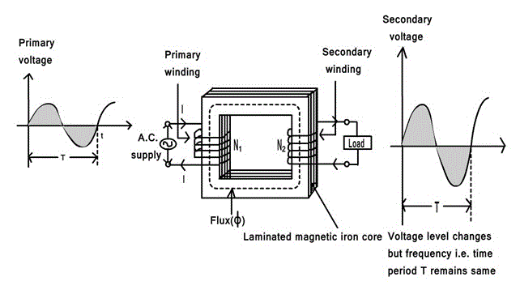
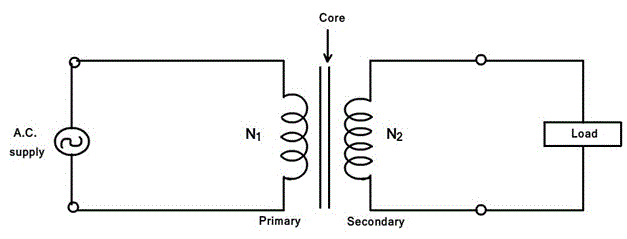
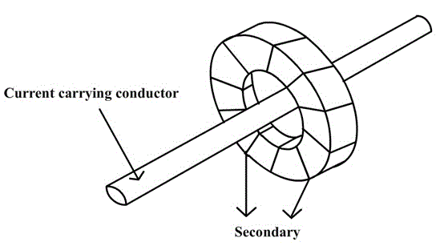
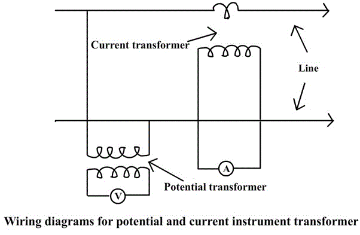

There is a need for constant secondary from the transformers in substations. But when there is a change in the primary voltage of transformer, there will be a similar change in the secondary of the transformer. So the transformer is provided with on-load tap changer (OLTC) to provide constant secondary voltage. Let us see power transformer, On-load tap changer and instrument transformer in detail:

<u>**Transformers**</u>

The main advantage of alternating currents over direct currents is that, the alternative currents can be easily transferable from low voltage to high or high voltage to low. Alternating voltages can be raised or lowered as per requirements in the different stages of electrical networks as generation, transmission, distribution and utilization. This is possible with a state device called <u>transformer</u>. The transformer works on principle of mutual induction. It transfers an electrical energy from one circuit to other when there is no electrical connection between the two circuits. Thus we can define transformer as below:

<u>Key point</u>: The transformer is a static piece of apparatus by means of which an electrical power is transferred from one alternating current circuit to another with the desired change in voltage and current without any change in frequency.

As an example, see the fig below to see how transformers are used in transmission system:

Use of transformers in transmission system

Fig (a)

<u>Trivia</u>:- DC supply cannot be used for the transformers.

<u>**Principle of working**</u>  
It works on the principle of mutual induction, mutual induction states that when 2 coils are inductively coupled and if current in one coil is changed informally then an e.m.f. gets induced in the other oil. This e.m.f. can drive a current, when a closed path is provided to it. The transformer works on the same principle.

The basic transformer is shown in figure below

Basic transformer  
Fig (b)

An alternating voltage source is connected to one of the coils. This coil in which electrical energy is fed with the help of source is called primary winding (p).The other winding is connected to the load. The electrical energy which is transformed to this winding is drawn out to the load. This winding is called secondary winding(s).The primary winding has N1 number of turns while the secondary has N2 number of turns.

Symbolic representation of a transformer  
Fig (c)

The secondary voltage depends on the number of turns in primary and secondary winding. The secondary voltage will be having different voltage level but same frequency as the primary.

<u>**Ratios of transformer**</u>

Fig (d)

<u>**Voltage Ratio**</u>

The ratio of secondary induced e.m.f. to primary induced e.m.f. is known as voltage transformation ratio denoted as K.

(E2/E1) = (N2/N1) = K

K=(N2/N1)

<u>**Note**</u>:-

1. If N2 > N1 i.e. :K >1  
   We get E2 > E1 then the transformer is called step up transformer.
2. If N2 < N1 i.e. :K < 1  
   We get E2 < E1 then the transformer is called step down transformer.
3. If N2 = N1 i.e. :K = 1  
   We get E2 = E1 then the transformer is called isolation or 1:1 transformer.

<u>**Ideal transformer**</u>  
Ideal transformer has following properties:

1. No losses.
2. Windings have zero resistance.
3. All the flex produced by primary links with the secondary i.e. leakage flex is zero.
4. Permeability of core is so high that negligible current is required to establish the flex in it.

<u>**Current ratio**</u>  
In an ideal transformer there are no losses. Therefore the product of primary voltage V1 and primary current I1, is same as the product of secondary voltage V2 and the secondary current I2.  
So V1 I1 = input VA and V2 I2= output VA.  
For an ideal transformer,  
V1 I1 = V2 I2

(V2/V1) = (I2/I1) = K

Therefore the current are in the inverse ratio of the voltage transformative ratio.

<u>**Taps or Tap changer**</u>  
The transformer is provided with a taps in order to adjust the voltage ratio of the transformer. These taps are provided along the winding with connections to a tap-changing device that makes the physical change in the in-service tap. The tap changing device is usually placed on the primary winding to minimize the current to be switched and can be “off-circuit “ or “on-load” type .When the primary voltage is low, the tap changer reduces correspondingly the number of primary turns to maintain the secondary voltage constant. Similarly, when the primary voltage is high, the tap changer increases correspondingly the number of primary turns to maintain the secondary voltage constant.

<u>**Off-circuit taps**</u>  
In industrial power system, off-circuit taps are used with dry-type transformer, liquid-immersed transformer, when they are not connected directly to the utility power supply. On the primary (high voltage side) of step-down transformer, four full-capacity taps (five positions) are provided in four 2.5% steps, 2 above and 2 below normal. The tap-changer mechanism should change the taps on all three phases simultaneously. Also, it should be operable form ground level, with tap changer position for padlocking. Important thing here to be noticed is that the transformer must be de-energized before the tap changer mechanism is operated.

<u>**On-load tap changer**</u>  
On-load tap changers (OLTC) are mostly with oil-immersed transformer connected to the utility power supply at a voltage level exceeding 34.5kV.Because the majority of power companies stipulated a voltage variation of ±10 % in the power contract, the tap changer is provided with an equivalent range of voltage regulation of ±10 % in 16 or 32 steps. 16 step tap changer provides 5/4% voltage change in each step.32step tap changer provides 5/8% voltage change in each step thus more preferred.

When the tap-changer design requires an oil-expansion tank, it shall be piped to a separate compartment in the conservator. A separate tap-changer gas-detector relay is located in this pipe.

The tap-changing control equipment includes:

1. Control and paralleling equipment.
2. Line drop compensation equipment along with the current transformer to provide voltage control at a point remote from the measuring point.
<ul style="list-style-type: disc">
    <li>Automatic voltage-regulating relay.</li>
    <li>Weather proof control cabinet, accessible from ground level.</li>
</ul>

<u>**Oil-filled(immersed) transformers**</u>

Oil filled transformer makes use of oil for the cooling of major parts of a transformer.

Use of transformers in transmission system

Fig (e)

Oil filled transformers are transformers filled with a highly refined mineral oil that is used to insulate internal live parts of the transformer. The oil prevents corona and manages temperature control inside the transformer for the prevention of equipment and machinery overheating during the operation of large job applications. Because of oil inside the transformer being of non-combustible properties, these transformers are very safe and can operate machinery for long period of time.

<u>Oil or liquid preservation system for oil-filled transformer</u>

A preservation system is essential for a liquid-immersed transformer to allow- expansion and contraction of the liquid due to the changes in the temperature with-out exposing the insulating liquid to external contamination. The expansion space is known as “the oil preservation system”. There are four different designs:

<ul style="list-style-type: disc">
<li>Sealed tank</li>
<li>Gas-oil seal</li>
<li>Conservator</li>
<li>Conservator diaphragm</li>
</ul>

Let us see conservator design in detail:  
The conservator is an oil-expansion tank mounted above the highest oil point on the transformer. The transformer tank and conservator are connected through a pipe, and a gas-detector relay (buchholz relay ) is installed in the pipe. The transformer oil expands and contracts with the increase and decrease of the oil temperature. The conservator must therefore breathe to the surrounding air, and moisture in the air can be absorbed into the oil and insulation system. To prevent the moisture from entering the conservator, a silica gel breather is provided that will dry the air as the breathing takes place. As the silica gel absorbs the moisture, it will change from blue to pink in colour and must be changed to retain its drying capability. So maintenance is required.

The accessories for mineral-oil transformer generally consists of:

<ul style="list-style-type: disc">
  <li>A conservator tank.
<li>Buchholz relay ( gas-detector relay ) for conservator-type transformer. Buchholz relay is located in the pipe between the highest part of the transformer tank and conservator. The relay consists of two sets of contacts, one contact for trip upon surge and other alarm upon gas accumulation.</li>
<li>Breather of dehydrating type for conservator-type transformers containing a colour indicator( usually silica gel), piped to the conservator and mounted in such a way that it is accessible from ground level.</li>
<li>Winding temperature-indicator.</li>
<li>Oil temperature indicator.</li>
<li>Cooling equipment like radiators, fans for forced air cooling, and pumps for forced oil – and water- cooled transformer.</li>
</ul>

<u>**Instrument transformers**</u>

It is not practicable to connect instruments and meters directly to the lines in high voltage circuits, so instrument transformers are used. The two basic advantages of this method are:

<ul style="list-style-type: disc">
<li>Standard rated instruments may be used easily.</li>
<li>Operating personnel coming in contact with the instruments are not subjected to high voltage and currents of the lines, and so there is less danger to them. Even with a low-voltage system, instrument transformers are used for measuring large currents, so that heavy leads to the instrument panel and to the ammeter and other current terminals are avoided.</li>
</ul>

The instrument transformers are classified as
follows:

1. Potential transformers
2. Current transformers

<u>**Potential transformers(P.T.)**</u>:

A potential transformer is a step down transformer used along with a low range voltmeter for measuring a high voltage. The primary is connected across the high voltage supply and the secondary to the voltmeter or potential coil of the wattmeter. Since the voltmeter (or potential coil) impedance is very high, the secondary current is very small and the potential transformer behaves as an ordinary two winding transformer operating on no load.

Fig (f)

The above fig shows a potential transformer used to measure the voltage of a circuit. It may be noted that the secondary is grounded. This is done so that if the insulation breaks down, the high voltage does not endanger personnel who may be reading the meters.  
These transformers are made with <i>high quantity iron core operating at very low flux densities so that the magnetising current may be very small. </i>Careful designs ensure minimum variation of voltage ratio with load and minimum phase shift between input and output voltages. Potential transformers secondary are commonly designed for an output of 110V.

<u>**Current transformers**</u>:  
The range of the D.C. ammeter is extended using a shunt, similarly a current transformer performs the same function in A.C. circuits. Thus a high magnitude A.C. can be measured by a combination of current transformer and a low range ammeter.  
In current transformer, the primary side consists of a very few turns of thick cross-section connected in series with the high current lines. Mostly, the primary is just one turn formed by taking the line conductor through the secondary winding (fig (g)).

Fig (g)
Line conductor acting as primary

The secondary winding consists of large number of turns of fine wire designed for either 5A or 1A rating. Thus a current transformer is a step up transformer. The current transformer has the secondary effectively short-circuited through the low impedance of the ammeter. The fig (h) below shows the current transformer connections.

Fig (h)

The current transformer ratio is not equal to the ratio of secondary to primary turns, mainly because of the effect of magnetizing current.  
A current transformer must never be operated on open circuit for the following reasons:

<ul style="list-style-type: disc">
<li>There will be no secondary m.m.f. and since the primary current(and m.m.f.) is fixed, the core flux will increase enormously. This will cause large amount of eddy current and hysteresis losses and the resulting high temperature may damage the insulation or even the core.</li>
<li>As the secondary side is open , a very high voltage will be induced in the multi-turn secondary and this high voltage is dangerous to both life and to the insulation.</li>
</ul>

Fig (i)

The above diagram shows the wiring diagram for potential and current instrument transformers.

